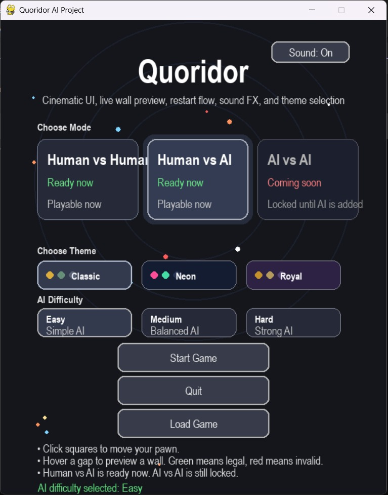
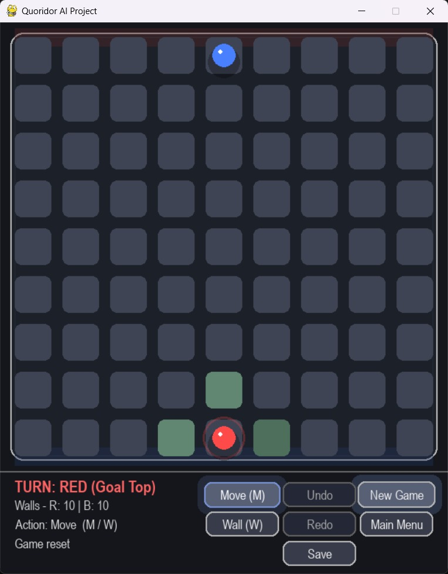
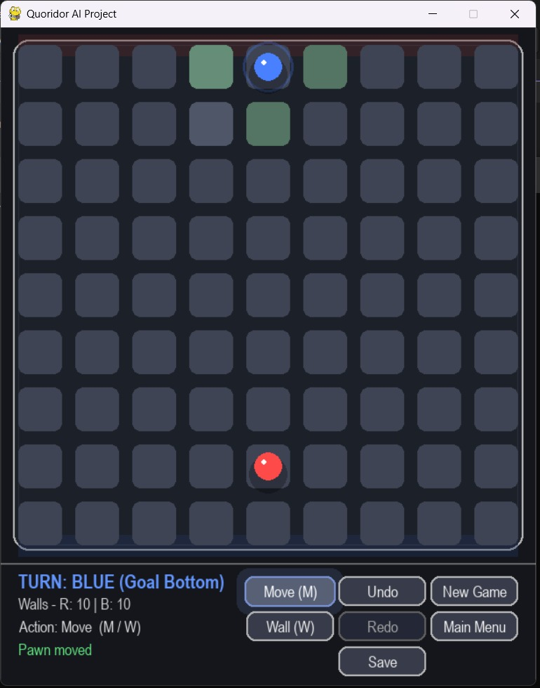
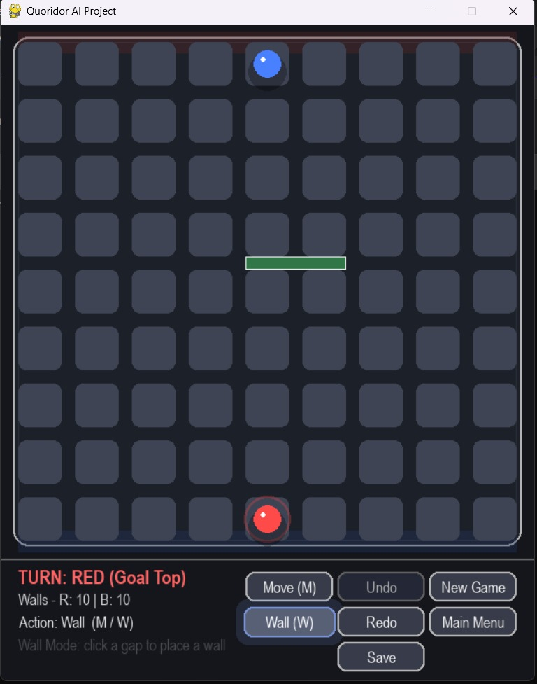
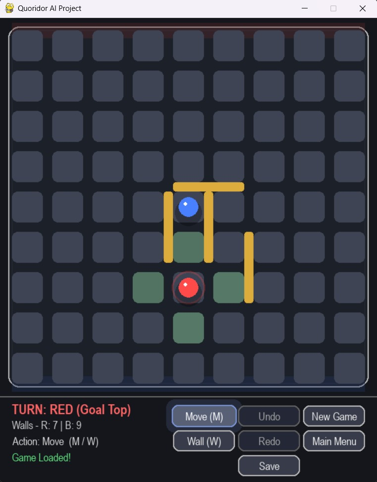
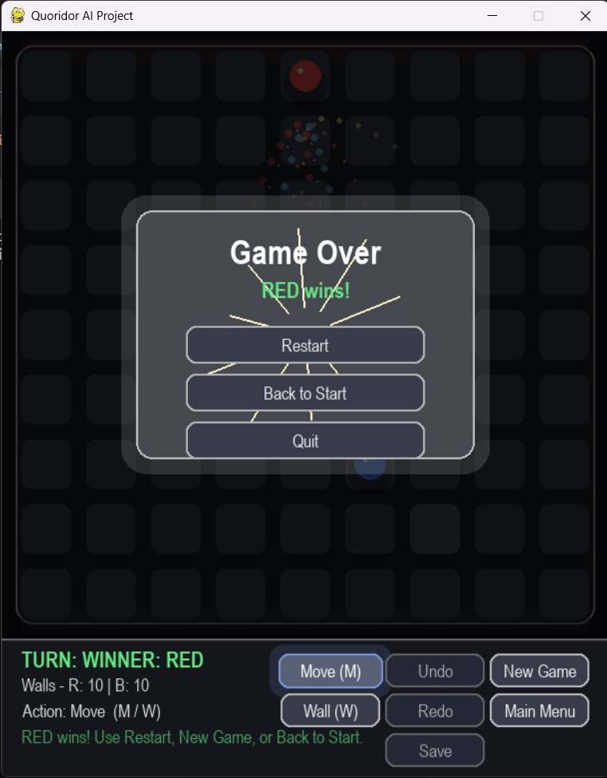

# Quoridor AI Game Implementation

A polished **Python/Pygame** implementation of the abstract strategy board game **Quoridor**, developed for the **CSE472s Artificial Intelligence Course – Spring 2026**.

The project combines complete 2-player Quoridor gameplay, a cinematic graphical interface, Human vs Human mode, Human vs AI mode, AI difficulty levels, live wall preview, path-safety validation, save/load, undo/redo, sound effects, particles, animations, and an expansion-ready AI-vs-AI structure.

---

## Team Members

| Name | ID |
|---|---:|
| Abdullah Mahmoud Hamed | 2300187 |
| Abdelrahman Khaled Abdelaziz | 2300415 |
| Anas Mohamed Fawzy | 2300044 |

---

## Demo Video


**Demo Video Link:** `https://drive.google.com/file/d/1P_Sn13tT2kxjXeKZAi5ihCeoLELVCcOg/view?usp=sharing`

---

## Project Screenshots

### Main Menu and AI Difficulty Selection



The main menu includes match mode cards, theme selection, a sound toggle, a load-game option, and visible AI difficulty levels for Human vs AI mode.

### Gameplay Board



The board shows both pawns, legal movement hints, wall counters, current turn, selected action mode, and the in-game control panel.

### Move and Wall Interaction

| Legal Move Hints | Wall Preview |
|---|---|
|  |  |

Green highlights show valid pawn moves or legal wall placements. The live wall preview helps the player avoid illegal moves before committing an action.

### Save, Load, and Game Over

| Saved / Loaded State | Winner Overlay |
|---|---|
|  |  |

The game supports persistent board state through save/load, and the winner screen provides restart, back-to-start, and quit options.

---

## Game Description

**Quoridor** is a turn-based strategy board game played on a **9×9 grid**. Each player starts from the center of their base line and tries to reach the opposite side of the board first.

On every turn, a player must choose one of two actions:

1. **Move the pawn** one legal square.
2. **Place a wall** to slow the opponent.

Walls are used strategically, but they cannot completely block either player from reaching the goal. The project uses path-finding validation to ensure both players always have at least one valid path to their target row.

---

## Main Features

### Core Gameplay

- Complete 2-player Quoridor implementation on a 9×9 board.
- Red player starts at the bottom and aims for the top.
- Blue player starts at the top and aims for the bottom.
- Each player starts with 10 walls.
- Legal pawn movement with orthogonal movement.
- Jump-over-opponent rule support.
- Diagonal bypass when a jump is blocked by a wall.
- Winner detection when a pawn reaches the opposite goal row.

### Wall System

- Horizontal and vertical wall placement.
- Collision checking for overlapping and crossing walls.
- Wall count tracking for both players.
- Live wall preview before placement.
- Green preview for valid wall placements.
- Red preview for invalid wall placements.
- Path validation to prevent completely blocking any player.

### Game Modes

| Mode | Status | Description |
|---|---|---|
| Human vs Human | Ready | Local 2-player gameplay on the same computer. |
| Human vs AI | Ready | Human player competes against the AI-controlled Blue player. |
| AI vs AI | Expansion-ready | Visible in the interface as a prepared future extension. |

### AI Difficulty Levels

The Human vs AI mode includes three difficulty profiles:

| Difficulty | Search Depth | Randomness | Wall Usage | Behaviour |
|---|---:|---:|---|---|
| Easy | 1 | 45% | No | Simple AI, suitable for first-time testing. |
| Medium | 2 | 15% | Yes | Balanced AI with movement and wall decisions. |
| Hard | 3 | 0% | Yes | Stronger AI with deeper search and no random mistakes. |

The AI uses **Minimax with Alpha-Beta pruning**, shortest-path evaluation, candidate wall generation, and action ordering to select moves efficiently.

### UI/UX Features

- Cinematic dark interface.
- Rounded board cells and clean control panels.
- Classic, Neon, and Royal visual themes.
- Sound toggle.
- Procedural sound effects.
- Smooth pawn movement animations.
- Wall placement animation.
- Particle effects.
- Animated winner overlay.
- Status feedback for moves, walls, invalid actions, save/load, undo/redo, and victory.

### Bonus Features

- **Undo** previous moves.
- **Redo** undone moves.
- **Save** the current game state to disk.
- **Load** a saved game state.

---

## Project Structure

```text
GAME_Q/
│
├── main.py      # Application entry point and main event loop
├── logic.py     # Core Quoridor rules, movement, wall validation, undo/redo, save/load
├── ai.py        # AI logic, Minimax, Alpha-Beta pruning, evaluation, difficulty levels
├── gui.py       # Rendering layer for menu, board, pawns, walls, buttons, and overlays
└── ui_ux.py     # Themes, audio, particles, animations, coordinates, and UI helpers
```

### Module Responsibilities

| File | Responsibility |
|---|---|
| `main.py` | Starts the game, manages scenes, handles input, triggers AI turns, and coordinates the full loop. |
| `logic.py` | Contains the rule engine: legal moves, wall validation, path checking, state history, undo/redo, and save/load. |
| `ai.py` | Generates legal AI actions, evaluates board states, and chooses actions using Minimax with Alpha-Beta pruning. |
| `gui.py` | Draws the menu, board, walls, pawns, status bar, buttons, and winner overlay. |
| `ui_ux.py` | Stores theme palettes, sound generation, animation helpers, particle helpers, coordinate conversion, and shared UI constants. |

---

## Installation

### 1. Clone the Repository

```bash
git clone YOUR_GITHUB_REPOSITORY_LINK_HERE
cd GAME_Q
```

### 2. Create a Virtual Environment

```bash
python -m venv venv
```

Activate it:

```bash
# Windows
venv\Scripts\activate

# macOS / Linux
source venv/bin/activate
```

### 3. Install Dependencies

```bash
pip install pygame
```

Or, if a `requirements.txt` file is included:

```bash
pip install -r requirements.txt
```

---

## Running the Game

Run the game from the project folder:

```bash
python main.py
```

The game window should open with the main menu.

---

## Controls

### Main Menu

| Action | Control |
|---|---|
| Select game mode | Click Human vs Human or Human vs AI |
| Select AI difficulty | Click Easy, Medium, or Hard in Human vs AI mode |
| Select theme | Click Classic, Neon, or Royal |
| Toggle sound | Click Sound On/Off |
| Start game | Click Start Game |
| Load saved game | Click Load Game |
| Quit | Click Quit |

### In-Game Controls

| Action | Control |
|---|---|
| Move Mode | Click `Move (M)` or press `M` |
| Wall Mode | Click `Wall (W)` or press `W` |
| Move pawn | In Move Mode, click a valid highlighted square |
| Place wall | In Wall Mode, click a valid wall gap |
| Undo | Click Undo |
| Redo | Click Redo |
| Save game | Click Save |
| New game | Click New Game |
| Return to menu | Click Main Menu |

---

## AI Design

The AI player is the **Blue** player in Human vs AI mode. The AI searches possible future game states and chooses the action that improves its position while slowing the opponent.

### AI Pipeline

1. **Clone the current game state** so the live board is not modified during search.
2. **Generate legal actions**, including pawn moves and candidate walls.
3. **Evaluate each position** using shortest-path distance and wall advantage.
4. **Apply Minimax search** to compare future outcomes.
5. **Use Alpha-Beta pruning** to skip branches that cannot affect the decision.
6. **Return the best action** to the main game loop.
7. **Animate the selected action** in the interface.

### Evaluation Function

The evaluation function rewards positions where the AI has a shorter path to the goal and where it has more walls remaining than the opponent.

```text
score = (opponent_distance - ai_distance) * 25
      + (ai_walls - opponent_walls) * 2
```

Winning and losing states receive very large positive or negative scores.

---

## Rule Validation

The game logic validates actions before updating the board.

### Pawn Movement Validation

- Pawns move one square orthogonally.
- Pawns cannot move through walls.
- Pawns cannot move outside the board.
- If the opponent is adjacent, a jump is allowed if not blocked.
- If the jump is blocked, diagonal bypass moves are allowed when legal.

### Wall Validation

A wall placement is rejected if:

- The player has no walls left.
- The wall is outside the allowed wall grid.
- The wall overlaps another wall.
- The wall crosses another wall.
- The wall completely blocks Red or Blue from reaching the goal.

Path safety is checked using breadth-first search.

---

## Save and Load

The game supports saving the current board state to a JSON file named:

```text
savegame.json
```

The saved state includes:

- Player positions
- Remaining wall counts
- Current turn
- Horizontal walls
- Vertical walls

When loading, stored wall lists are restored into sets and player positions are converted back into tuples so the game logic continues to work correctly.

---

## Testing Summary

| Test Case | Expected Result | Status |
|---|---|---|
| Start Human vs Human | Board resets and Red starts first | Passed |
| Start Human vs AI | Human plays against Blue AI | Passed |
| Move to legal square | Pawn moves and turn changes | Passed |
| Click illegal target | Error message appears and state does not change | Passed |
| Place legal wall | Wall appears and wall count decreases | Passed |
| Place blocking wall | Wall is rejected | Passed |
| Undo / Redo | Board returns to previous or next state | Passed |
| Save / Load | Game state is stored and restored | Passed |
| Win condition | Game-over overlay appears | Passed |

---

## Future Work

- Complete full AI-vs-AI automatic gameplay.
- Add AI analytics such as search depth, node count, score, and decision time.
- Improve the evaluation function with mobility and trap detection.
- Add 4-player mode.
- Package the game as a standalone executable.
- Add more themes and board skins.

---

## Technologies Used

- Python
- Pygame
- Minimax Search
- Alpha-Beta Pruning
- Breadth-First Search
- JSON Save/Load
- Procedural Audio

---

## References

- CSE472s Artificial Intelligence Course Project Description, Spring 2026.
- Pygame documentation.
- Standard Quoridor rules.
- Artificial intelligence concepts: adversarial search, evaluation functions, and Alpha-Beta pruning.
- Breadth-first search for grid path validation.

